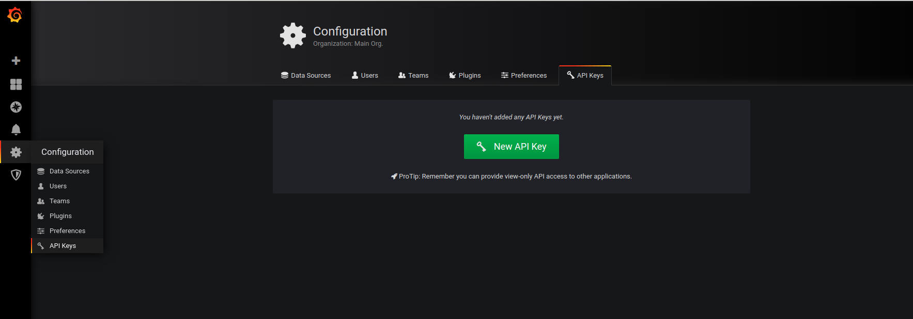
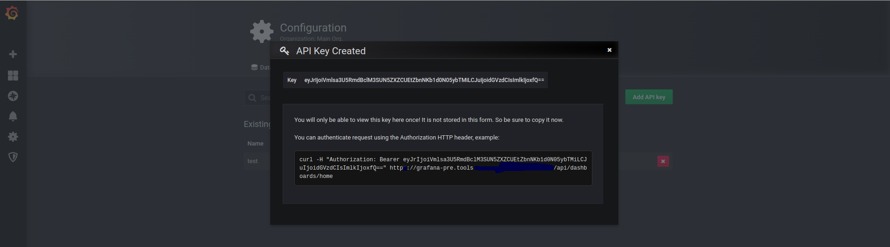

# grafana-migrate.py
Script to migrate grafana objects (folders, dashboards...) from one grafana to another

# Configuration file
**grafana-migrate.py** needs a configuration file in the mandatory parameter <-f|--file> in YAML format \
Example: grafana-migrate.py -f file_conf.yaml \
See the comments in the [file_conf_example.yaml][file_conf] file
[file_conf]: file_conf_example.yaml

# Create API KEYS
You have to create two API KEYS, one from grafana source and another from grafana destination. From 
source, the script needs Viewer role and for destination Admin one

